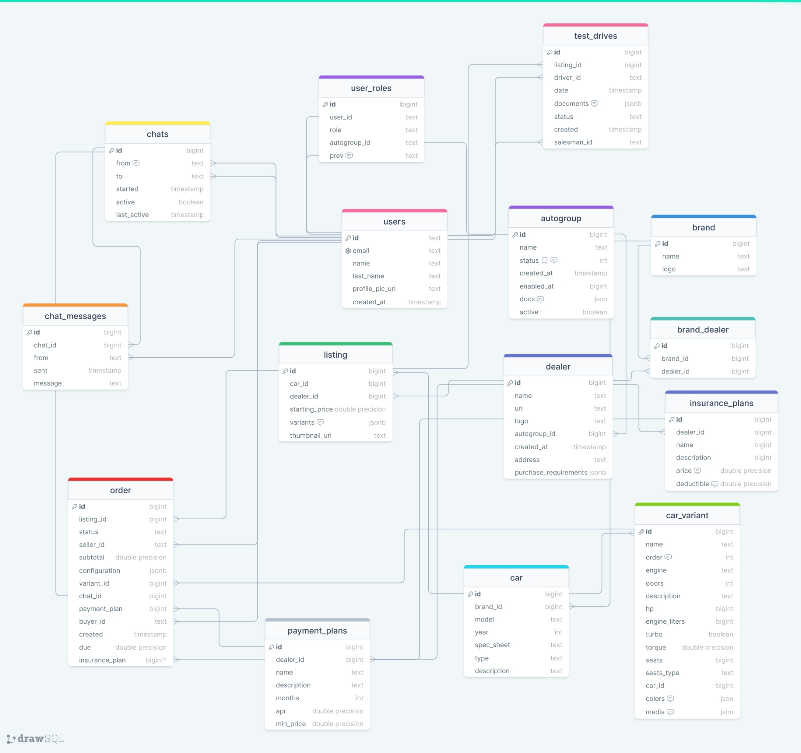
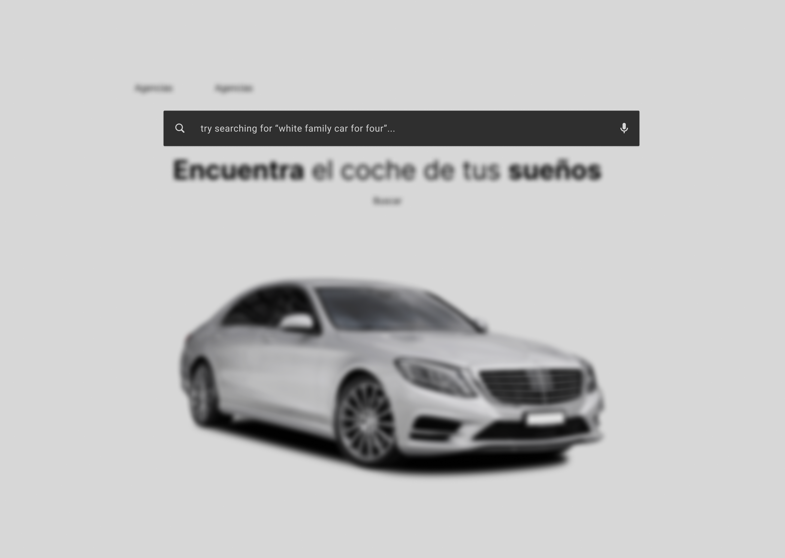
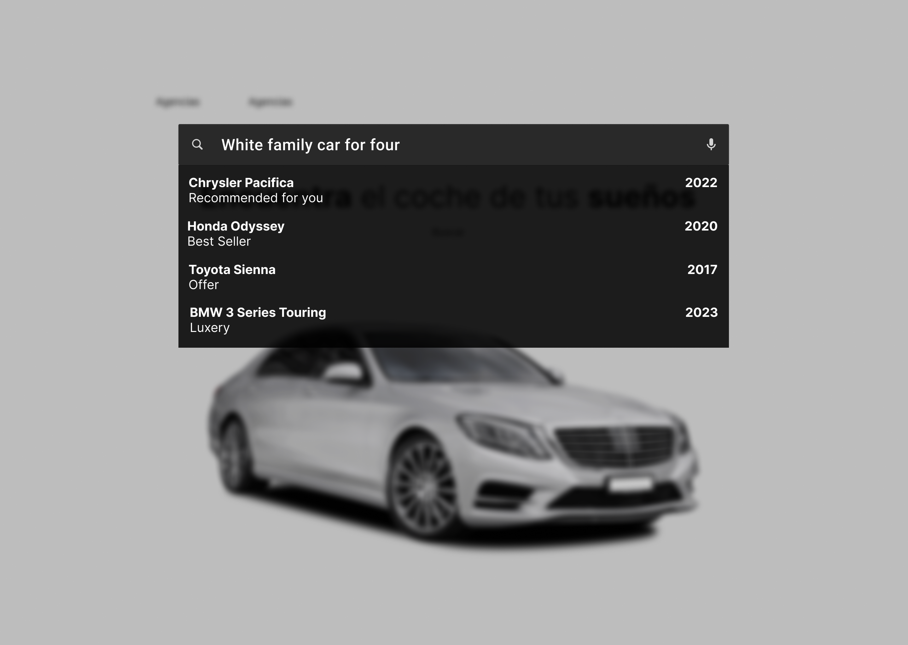
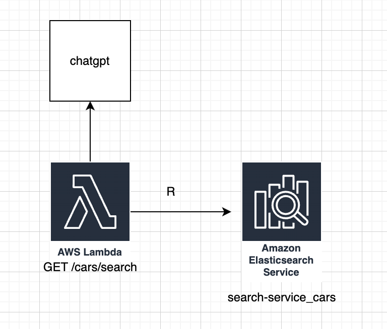

# Software Requirements Specification

## Team "MOVU"

## Tecnológico de Monterrey - Campus Campus Santa Fe

---

Version 0.1

---

_4/02/2023_

---

# Table of Contents

- [Software Requirements Specification](#software-requirements-specification)
  - [TC3004B.102 - Team 3 "Blueprint"](#tc3004b102---team-3-blueprint)
  - [Tecnológico de Monterrey - Campus Campus Santa Fe](#tecnológico-de-monterrey---campus-campus-santa-fe)
- [Table of Contents](#table-of-contents)
  - [Revision History](#revision-history)
  - [1. Introduction](#1-introduction)
    - [1.1 Purpose](#11-purpose)
    - [1.2 Document Conventions](#12-document-conventions)
    - [1.3 Project Scope](#13-project-scope)
    - [1.4 References](#14-references)
  - [2. Overall Description](#2-overall-description)
    - [2.1 Product Perspective](#21-product-perspective)
    - [2.2 User Classes and Characteristics](#22-user-classes-and-characteristics)
      - [Super Admins (Application manager)](#super-admins-application-manager)
      - [Admins (Car group owner)](#admins-car-group-owner)
      - [Managers (Car dealership manager)](#managers-car-dealership-manager)
      - [Salesman (Car dealership salesman)](#salesman-car-dealership-salesman)
      - [Regular Users (Car buyers)](#regular-users-car-buyers)
    - [2.3 Operating Environment](#23-operating-environment)
    - [2.4 Design and Implementation Constrains](#24-design-and-implementation-constrains)
    - [2.5 Assumptions and Dependencies](#25-assumptions-and-dependencies)
  - [3. System Features](#3-system-features)
    - [3.1 Search](#31-search)
    - [Description](#description)
    - [Stimulus/Response Sequences](#stimulusresponse-sequences)
    - [FunctionalRequirements](#functionalrequirements)
    - [3.2 Metrics System](#32-metrics-system)
    - [Description](#description-1)
    - [Stimulus/Response Sequences](#stimulusresponse-sequences-1)
    - [FunctionalRequirements](#functionalrequirements-1)
    - [3.3 Payments](#33-payments)
    - [Description](#description-2)
    - [Stimulus/Response Sequences](#stimulusresponse-sequences-2)
    - [Functional Requirements](#functional-requirements)
    - [3.4 Data visualization](#34-data-visualization)
    - [Description](#description-3)
    - [Stimulus/Response Sequences](#stimulusresponse-sequences-3)
    - [Functional Requirements](#functional-requirements-1)
    - [3.5 Admin Dashboard](#35-admin-dashboard)
    - [Description](#description-4)
    - [Stimulus/Response Sequences](#stimulusresponse-sequences-4)
    - [Functional Requirements](#functional-requirements-2)
    - [3.6 User Dashboard](#36-user-dashboard)
    - [Description](#description-5)
    - [Stimulus/Response Sequences](#stimulusresponse-sequences-5)
    - [Functional Requirements](#functional-requirements-3)
    - [3.7 Account management](#37-account-management)
    - [Description](#description-6)
    - [Stimulus/Response Sequences](#stimulusresponse-sequences-6)
    - [Functional Requirements](#functional-requirements-4)
    - [3.7 Devops](#37-devops)
    - [Description](#description-7)
    - [Stimulus/Response Sequences](#stimulusresponse-sequences-7)
    - [Functional Requirements](#functional-requirements-5)
  - [4. Data Requirements](#4-data-requirements)
    - [4.1 Logical Data Model](#41-logical-data-model)
    - [4.2 Data Dictionary](#42-data-dictionary)
    - [4.3 Reports](#43-reports)
    - [4.4 Data Acquisition, Integrity, Retention, and Disposal](#44-data-acquisition-integrity-retention-and-disposal)
  - [5. External Interface Requirements](#5-external-interface-requirements)
    - [5.1 User Interfaces](#51-user-interfaces)
      - [Logical Characteristics of the User Interface](#logical-characteristics-of-the-user-interface)
      - [Software Components Requiring User Interface](#software-components-requiring-user-interface)
    - [5.2 Software Interfaces](#52-software-interfaces)
    - [Future](#future)
    - [5.3 Hardware Interfaces](#53-hardware-interfaces)
    - [5.4 Communications Interfaces](#54-communications-interfaces)
  - [6. Quality Attributes](#6-quality-attributes)
    - [6.1 Usability](#61-usability)
    - [6.2 Performance](#62-performance)
    - [6.3 Security](#63-security)
    - [6.4 Safety](#64-safety)
  - [7. Internationalization and Localization Requirements](#7-internationalization-and-localization-requirements)
  - [8. Other Requirements](#8-other-requirements)
  - [9. Appendix A: Glossary](#9-appendix-a-glossary)

## Revision History

| Name                                          | Date    | Reason For Changes                            | Version |
| --------------------------------------------- | ------- | --------------------------------------------- | ------- |
| Salvador Salgado                              | 3/01/23 | Document Creation                             | v0.01   |
| Miguel Arriaga & Pablo Rocha                  | 3/06/23 | Introduction and Overall Description          | v0.02   |
| Salvador Salgado, Miguel Arriaga, Pablo Rocha | 2/07/23 | Requirements                                  | v0.03   |
| Miguel Arriaga, Pablo Rocha, Jacobo Soffer    | 2/08/23 | First Version, revised by Gilberto Echeverría | v0.1    |

## 1. Introduction

### 1.1 Purpose

This is a comprehensive document that outlines the requirements and specifications for the software project. It serves as a roadmap for the development team, providing a clear understanding of what is expected of the software and how it will be designed, developed, tested, and deployed.

It will define the scope of the software project, including its goals, objectives, features, and functions. It provides a clear description of the software's behavior, user interactions, and performance requirements. It identifies any constraints or limitations that may affect the software's design and development.

In addition to serving as a guide for the development team, it will serve as a communication tool for stakeholders, such as project managers, clients, and end-users. It helps ensure that all parties have a clear understanding of the software's requirements and expectations, reducing the risk of miscommunication and misunderstandings.

### 1.2 Document Conventions

For this document, we are utilizing the Software Requirements Standard (SRS), which consists of guidelines and structure that allow the requirements for better documentation, organization, and consistency.

Using this standard also enhances the communication during implementation. A standard structure and format for requirements documents make it easier for stakeholders to understand and discuss the requirements, reducing confusion and misunderstandings. Using SRS also facilitates collaboration and work towards the final project envision, reducing time loss and unnecessary work that might occur by unclear requirements.

### 1.3 Project Scope

The product scope for this project entails the development of a web page that enables efficient and seamless communication between car agencies and their clients. Our collaboration with NDS Cognitive Labs has prompted the identification of key objectives and requirements for the software, including the need for a user-friendly interface that simplifies the online process for both salespersons and clients.

To achieve this goal, it is essential to design a web page that provides clear and concise information regarding the current stage of the purchasing process. The user interface should be intuitive and straightforward, allowing clients to search for their desired vehicle without encountering technical barriers or complex filters.

In order to ensure the success of the project, it is important to understand the needs and preferences of both the car agencies and their clients. This includes conducting thorough market research and analysis to identify common pain points and concerns related to the purchasing process.

Furthermore, the software should be designed with scalability in mind to accommodate future growth and expansion. As such, the product scope must also include provisions for future updates and improvements to enhance the user experience and maintain the software's competitiveness in the marketplace.

In summary, the product scope for this project is to develop a web page that facilitates smooth and intuitive communication between car agencies and their clients, with a focus on providing an easy-to-use service that simplifies the online purchasing process for all parties involved.

### 1.4 References

- https://www.iso.org/isoiec-27001-information-security.html#:~:text=ISO%2FIEC%2027001%20is%20the,the%20ISO%2FIEC%2027000%20family.
- https://www.w3.org/TR/WCAG20/#:~:text=Web%20Content%20Accessibility%20Guidelines%20(WCAG)%202.0%20defines%20how%20to%20make,%2C%20learning%2C%20and%20neurological%20disabilities.

## 2. Overall Description

This document is divided into 5 sections. The first section is the introduction, which will explain the purpose of the document, the scope of the project, and the definitions, acronyms and abbreviations that will be used throughout the document. The second section will be the product overview, which will explain the context and origin of the product being specified in this SRS. The third section will be the requirements, which will explain the functional, non-functional, and design requirements of the product. The fourth section will be the verification, which will explain the verification and validation of the product.

The rest of the document will explain the various elements that define how the application is expected to work based on the user characteristics ( vendors and customers), the specific needs of the product owner, as well as the architecture proposal.

### 2.1 Product Perspective

The product being specified in this SRS is a new, self-contained web page that enables simple and intuitive communication between car agencies and their clients. This project is a collaboration between the development team and NDS Cognitive Labs, with the aim of creating an online platform that facilitates a smooth purchasing process for both the car agencies and their clients.

The main objective of the project is to provide an easy-to-use service that allows salespersons and clients to have a clear understanding of the current stage of the purchasing process. The web page will also feature an intuitive search option without any technical filters.

The product is a standalone software component that will serve as the interface between car agencies and their clients. It is not a follow-on member of a product family, nor is it a replacement for any existing systems. The web page will be the primary means of communication between the two parties and will be built from scratch.

The larger system that this product will be a component of is the car sales process. The product's functionality will directly impact the smoothness and efficiency of this process. The external interfaces of the product will include the car agency's website and the clients' devices, such as smartphones and laptops.

### 2.2 User Classes and Characteristics

There are going to be five types of users in the web application:

#### Super Admins (Application manager)

User with all available permissions for web application administration. This will be assigned to NDS at the end of development.

- The super admin can approve or deny a automobile group

- The super admin can remove a automobile group.

- The super admin can update a automobile group.

- Super admins can view: Dashboard to manage automobile groups.

- A super admin can validate the documents of an automobile group.

- Super admins can adjust commissions for automobile groups.

#### Admins (Car group owner)

User with master data editing permissions, user creation permissions, and inventory administration permissions. In this case it would correspond to the various automotive groups.

- Only car group owner can preform the following actions: Add dealerships, Remove Dealerships, Modify dealerships.

- Only car group owner can preform the following actions: Add a manager, Remove a manager, Modify a manager

#### Managers (Car dealership manager)

Manager of a registered agency in the application. Has permission to review the inventory of their particular registered agency on the site. Has permission to review data related to the sale of their inventory.

- Managers can preform the following actions: Add a salesman, remove a salesman, modify a salesman
- Manger can upload or edit the agency car catalog
- Managers can add financing plans to cars.

#### Salesman (Car dealership salesman)

Employee of a registered agency in the application. Has permission to review the particular inventory of their registered agency.

- Only a salesman or manager can perform: Add a car, Remove a car, Modify a car

- A salesman can approve or deny user documents.

#### Regular Users (Car buyers)

Customer with the opportunity to register and purchase a car within the page.

- Regular users are able to sign up for a user level account.

- User will be able able to create an account in the app.

- The user will be able to use their credentials to log in to the app.

- A regular user can see cars.

- A regular user can do all the process of buying cars

 

**User Stories**

 

**Facilitate Car Search for non Technical Clients**

The system will be able to allow car searches without the help of advanced filters.

_ex: “Big red car for 6 people”_

 

**Facilitate Acquisition process**

Both clients and vendors will be able to observe the current status of the purchasing process in real time. (Documents approvals, Drive Testing, Payment Verification)

 

**Data Analysis**

Automotive Groups, Agencies, Manager and Vendors will be able to get data insights depending on its roles for futures actions.

_ex: Manager will have insight of the number of sells per Vendor, Automotive Groups will be able to preview the top sell Agencies and average reviews from vendors._

 

**Online Payment**

The system will allow clients to make the payments online payments directly to the agencies.

 

**Agency Catalog/Services Upload**

The various Agencies will be able to upload their various car catalogs, payments options as well as assurance services.

 

The full users stories can be found in [User stories](wiki/User%20Stories.md)

Some potential product constraints for this project could include:

- Interfaces: The web application will need to have a user-friendly interface that allows users to easily search for cars and dealerships. It will also need to have an interface for dealerships to upload their inventory and manage orders. Additionally, the application may need to integrate with other third-party applications or services, such as payment processors or shipping providers.

- Quality of service: The web application should be reliable, fast, and secure. Users should be able to access the site at all times, and their data should be protected from unauthorized access or data breaches. The application should also be scalable to handle increased traffic as more users and dealerships sign up.

- Standards compliance: The application should comply with any relevant industry standards, such as those around data privacy or online sales. It should also adhere to any relevant laws or regulations, such as those governing the sale of vehicles.

- Design and implementation: The application should be designed to be accessible to users with disabilities, and should be optimized for mobile devices as well as desktop computers. The developers may also need to choose a suitable technology stack for the project, taking into account factors such as cost, ease of use, and compatibility with existing systems. Finally, the application should be easy to maintain and update over time.

### 2.3 Operating Environment

The system uses a micro service architecture where every service will run on a Linux based Docker container on any host operating system. Because of this, no software or hardware limitations are considered for this system, as long as it supports running Docker, which any fairly modern platform should support. However, a minimum of 2 CPU cores and 4 GB of RAM
is suggested to run the system.

### 2.4 Design and Implementation Constrains

Cloud: The application will be hosted on a cloud platform, such as Amazon Web Services. This will allow the application to scale easily as the number of users and dealerships increases.

Safety: The application will be designed to be secure and reliable. It will use HTTPS to encrypt all data in transit, and will use a database that is protected from unauthorized access. The application will also be designed to be resilient to common types of attacks, such as SQL injection and cross-site scripting.

Standards compliance: The application will comply with any relevant industry standards, such as those around data privacy or online sales. It will also adhere to any relevant laws or regulations, such as those governing the sale of vehicles.

Car search: The application will allow users to search for cars using a variety of filters, such as make, model, price, and location. It will also allow users to search for cars using natural language, such as “red car for 6 people”.

### 2.5 Assumptions and Dependencies

**Assumptions:**

The car agencies have the necessary information and resources to provide accurate and up-to-date information on the vehicles available for sale.
Clients have access to a stable internet connection and compatible devices to access the web page.
The payment gateway provider will be able to provide a secure and reliable payment processing system.
The market research and analysis conducted will accurately identify the common pain points and concerns related to the purchasing process.
The software development team has the necessary expertise and resources to design and develop the web page according to the identified requirements.

**Dependencies:**

The successful completion of market research and analysis is required before proceeding with the design and development of the web page.
The availability of car agency representatives for consultation and feedback during the development process.
The integration of the payment gateway provider's system with the web page.
The compatibility of the web page with various devices and web browsers.

## 3. System Features

### 3.1 Search

### Description

The feature is a new addition to the car dealership's website that helps users find their perfect car in a guided way. This feature comes with two options: filters and natural language.

With the filters option, users can narrow down their search by selecting specific parameters such as the make and model, body style, fuel type, transmission, and more. Users can also filter their search by location, price range, and other relevant factors. Once the filters are selected, the system will display a list of cars that match the user's search criteria. The filters will not be obvious, they will be determined by a guided process of questions.

With the natural language option, users can use words to describe the car they are looking for. For example, they can type things like "I am looking for a red SUV with a sunroof and leather seats," and the system will use natural language processing to understand their request and provide a list of cars that match their description.

Once users have selected a car or described their requirements, the system will provide detailed information about the car, including photos, specifications, features, and pricing. Users can also schedule a test drive, request a quote, or contact the dealership directly to learn more about the car.

This feature is perfect for people who are looking for a new car but are not sure where to start. It saves time and effort by providing a guided search experience that is easy to use and highly personalized.

### Stimulus/Response Sequences

Use Case 1: User finds a new car using a guided process

1. User navigates to the car dealership's website and clicks on the search feature.
1. System displays a guided process that asks the user a series of questions to help them find the car they are looking for.
1. User answers the questions by selecting the relevant options or typing in their responses.
1. System uses the user's responses to suggest cars that match their preferences and displays detailed information about each car such as photos, specifications, features, and pricing.
1. User can view the details of each car and narrow down their search by refining their preferences or sorting the results.

Use Case 2: User describes their requirements using natural language

1. User navigates to the car dealership's website and clicks on the search feature.
1. System displays a text box where the user can describe the car they are looking for using natural language.
1. User types in their description, such as "I want a red SUV with a sunroof and leather seats."
1. System uses natural language processing to understand the user's request and displays a guided process of questions to clarify their preferences and suggest cars that match their requirements.
1. User answers the questions by selecting the relevant options or typing in their responses.
1. System uses the user's responses to suggest cars that match their preferences and displays detailed information about each car such as photos, specifications, features, and pricing.
1. User can view the details of each car and narrow down their search by refining their preferences or sorting the results.

In both use cases, the system responds by displaying relevant information to the user and guiding them through the process of finding a new car.

### FunctionalRequirements

| ID. Functional REQ | Concept                 | Description/ Criteria of acceptance                                                                    |
| ------------------ | ----------------------- | ------------------------------------------------------------------------------------------------------ |
| REQ*FUN*[001]      | Natural Language Search | User will be able to search car recommendations based on a description without need of technicalities. |
| REQ*FUN*[002]      | Non login search        | User will be able to make a search without having any account                                          |
| REQ*FUN*[003]      | Search Priority         | The car appearance will be influenced based on prioritization (extra payment)                          |

### 3.2 Metrics System

### Description

The Metrics System is a data collection and analysis tool designed to help the car dealership gain insights into user behavior and system performance. The system collects data from various sources, including user interactions with the website, system events, and sales data. The data is then stored in a centralized database and analyzed using business intelligence tools.

The Metrics System provides various reports and dashboards to different user roles in the organization, including admins, super admins, salespeople, and managers. These reports and dashboards provide insights into user demographics, search preferences, cars viewed, test drives scheduled, quotes requested, purchases made, and customer feedback.

Super admins can use the system to monitor the growth of the business and track the performance of multiple dealerships. They can view data from different regions, brands, and models, and compare performance metrics across different time periods.

Salespeople can use the system to track their own performance, including the number of sales, customer reviews, and other key performance indicators. They can also view customer data, including preferences and purchase history, to personalize their sales approach.

Managers can use the system to monitor the performance of their sales team, including revenue generated, conversion rates, and customer satisfaction. They can also identify areas for improvement and make data-driven decisions to optimize the sales process.

Finally, the Metrics System also includes a log collection feature to store important events for audit purposes. This ensures that the dealership remains compliant with regulatory requirements and can provide a detailed audit trail if necessary.

### Stimulus/Response Sequences

Stimulus: A user completes a purchase of a car on the website
Response: The Metrics System records the sale and updates the sales data for the dealership. The system generates a report showing the number of sales made in the past week, month, and year.

Stimulus: A user submits a request for a test drive on the website
Response: The Metrics System records the test drive request and updates the user's record with their preferred date and time. The system generates a report showing the number of test drive requests made in the past week, month, and year.

Stimulus: A salesperson logs into the system
Response: The Metrics System displays a dashboard showing the salesperson's performance metrics, including the number of sales made, customer reviews received, and conversion rate. The system also displays customer data, including preferences and purchase history.

Stimulus: A manager logs into the system
Response: The Metrics System displays a dashboard showing the performance metrics for the entire dealership, including revenue generated, conversion rates, and customer satisfaction. The system also displays performance metrics for each salesperson and allows the manager to drill down into specific data points.

Stimulus: An admin runs a report on customer demographics
Response: The Metrics System generates a report showing the age, gender, and location of customers who have made a purchase on the website. The report also includes data on customer preferences and feedback.

Stimulus: A super admin runs a report on sales growth
Response: The Metrics System generates a report showing the sales growth for the dealership over the past year. The report includes data on sales by region, brand, and model, and allows the super admin to compare performance across different time periods.

### FunctionalRequirements

| ID. Functional REQ | Concept                             | Description/ Criteria of acceptance                                                                        |
| ------------------ | ----------------------------------- | ---------------------------------------------------------------------------------------------------------- |
| REQ*FUN*[004]      | Data recollection for admins        | The data generated by the user will allow business intelligence for the car agency.                        |
| REQ*FUN*[005]      | Data recollection for super admin   | The data generated will indicate how many agencies are registered and total growth.                        |
| REQ*FUN*[006]      | Data recollection for salesman      | The data generated by the users will provide the salesman their stats (number of sales, car reviews, etc.) |
| REQ*FUN*[007]      | Data recollection for manager       | The data generated by salesman will let the manager know their performance. Revenue for the dealership     |
| REQ*FUN*[008]      | Log recollection for audit purposes | All important events will be stores for the case of an audit                                               |

### 3.3 Payments

### Description

The Payments System is a key feature of our website that enables our clients to make secure online payments for their car purchases. We offer a variety of payment types to cater to our clients' preferences, including Down Payment, Financing, and Upfront Payment.

When a client chooses to make a payment, they will be redirected to our payment portal, where they can select their preferred payment method. Our system supports a range of payment methods, including Credit, Debit, Wire Transfer, and Oxxo, to ensure flexibility and convenience for our clients.

We use Stripe, a trusted and secure payment service, to process all payments made on our website. Stripe provides advanced security measures to protect our clients' sensitive information, such as encryption and fraud detection systems.

Throughout the payment process, our system provides clear and detailed instructions to guide the client through the steps. We strive to make the payment process as seamless and stress-free as possible, ensuring a positive experience for our clients.

Our Payments System is continuously monitored and updated to ensure the highest levels of security and reliability. We are committed to providing a smooth and hassle-free payment experience for our clients, ensuring their satisfaction with every transaction.

### Stimulus/Response Sequences

Stimulus: Client selects payment type
Response: System displays available payment types (Down Payment, Financing, Upfront Payment)

Stimulus: Client selects payment method
Response: System displays available payment methods (Credit, Debit, Wire Transfer, Oxxo)

Stimulus: Client enters payment information
Response: System securely processes payment using Stripe payment service

Stimulus: Payment is successful
Response: System displays confirmation of payment and updates order status

Stimulus: Payment is unsuccessful
Response: System displays error message and prompts client to try again with different payment information or method

Stimulus: System detects suspicious activity or fraud
Response: System triggers security protocols and flags payment for review by authorized personnel

### Functional Requirements

| ID. Functional REQ | Concept               | Description/ Criteria of acceptance                                                                       |
| ------------------ | --------------------- | --------------------------------------------------------------------------------------------------------- |
| REQ*FUN*[008]      | Online Payments       | The clients are able to make their payments online to the agency, using existing payment services: Stripe |
| REQ*FUN*[009]      | Commission Management | The Super Admin will determine commission fees for salesman                                               |
| REQ*FUN*[010]      | Payment types         | The client is able to select from a variety of payment types: Down payment, Financing, Upfront payment    |
| REQ*FUN*[011]      | Payment methods       | The user is able to select the following payment methods Credit, Debit, Wire Transfer, Oxxo               |

### 3.4 Data visualization

### Description

The Data Visualization feature is designed to provide users with an intuitive way to analyze and view data generated by the car agency. The feature allows users with different roles, including admins, super admins, salesmen, and managers, to access and visualize data relevant to their role.

With this feature, users can create customized plots based on the selected data, adjusting plot parameters such as colors and labels to suit their needs. The system generates plots in a visually appealing and user-friendly format, making it easy for users to analyze the data and draw insights.

Users will also have the option to download CSV files containing the data used to generate the plots, providing the ability to perform further analysis outside of the system. The data visualization feature is updated in real-time as new data is generated, ensuring users have access to the latest information.

Access to data is role-based, with admins only able to access data specific to their dealership, while super admins have access to data across all dealerships. The interface is designed to be user-friendly and easy to navigate, ensuring users can quickly find the data they need to make informed decisions.

### Stimulus/Response Sequences

Stimulus: User logs in to the system and selects the Data Visualization feature.
Response: System prompts user to select the role they are assigned to.

Stimulus: User selects their role and is presented with a dashboard displaying relevant data.
Response: System generates the dashboard and displays it to the user.

Stimulus: User downloads the CSV file containing the data used to generate the plot for further analysis.
Response: System generates the CSV file and allows user to download it.

### Functional Requirements

| ID. Functional REQ | Concept                            | Description/ Criteria of acceptance                                   |
| ------------------ | ---------------------------------- | --------------------------------------------------------------------- |
| REQ*FUN*[012]      | Data visualization for admins      | The data generated will be visualized in plots and downloadable csvs. |
| REQ*FUN*[013]      | Data visualization for super admin | The data generated will be visualized in plots and downloadable csvs. |
| REQ*FUN*[014]      | Data visualization for salesman    | The data generated will be visualized in plots and downloadable csvs. |
| REQ*FUN*[015]      | Data visualization for manager     | The data generated will be visualized in plots and downloadable csvs. |

### 3.5 Admin Dashboard

### Description

The admins dashboard section is a feature of the website that allows car dealership administrators to perform various tasks related to the management of their dealership. The section includes various functions such as post and manage cars, define required documents for purchasing a car, update user identity validation status, manage the car catalogue, manage car dealerships, manage driving tests, define payment plans, define account numbers, view the dealership's and individual performance, and manage ongoing deals and their status. These features help streamline the operations of the dealership by providing a centralized location for managing key aspects of the business. The dashboard can be accessed by authorized personnel and provides an overview of the dealership's performance as well as individual performance metrics for salesmen. Overall, this section is essential for efficient and effective management of a car dealership.

### Stimulus/Response Sequences

Stimulus: Admin clicks on "Add Car" button
Response: Admin is redirected to a page where they can input car details, upload pictures, and set the car's availability status.

Stimulus: Manager clicks on "Add New Payment Plan"
Response: Manager is directed to a page where they can create a new payment plan by specifying the down payment amount, financing options, and interest rates.

Stimulus: Salesman clicks on "Manage Driving Tests"
Response: Salesman is taken to a page where they can view and manage driving tests, including scheduling and grading tests.

Stimulus: Car Group Owner clicks on "View Dealership Performance"
Response: Car Group Owner is presented with an overview of the dealership's performance, including total revenue, number of cars sold, and commission earned by salesmen.

Stimulus: Dealership Manager clicks on "View Salesman Performance"
Response: Dealership Manager is shown a list of salesmen and their individual performance metrics, such as the number of cars sold and commission earned.

Stimulus: Salesman clicks on "View Ongoing Deals"
Response: Salesman is presented with a list of their ongoing deals and their current status, including whether the deal is pending, approved, or rejected.

### Functional Requirements

| ID. Functional REQ | Concept                                      | Description/ Criteria of acceptance                                                                             |
| ------------------ | -------------------------------------------- | --------------------------------------------------------------------------------------------------------------- |
| REQ*FUN*[016]      | Post and manage cars                         | Car dealership can perform CRUD operations on cars through admin dashboard                                      |
| REQ*FUN*[017]      | Define required documents to buy cars        | Car dealership can indicate which documents are needed through the admin dashboard                              |
| REQ*FUN*[018]      | Update users identity validation status      | The car dealership can update a specific user’s validation status through the dashboard                         |
| REQ*FUN*[019]      | Manage car catalogue                         | Upload the complete catalogue of the agency                                                                     |
| REQ*FUN*[020]      | Manage car dealerships                       | Add, remove, approve or deny car dealerships                                                                    |
| REQ*FUN*[021]      | Manage driving tests                         | The salesman is able to manage driving tests for users.                                                         |
| REQ*FUN*[022]      | Define payment plans                         | The manager of a car agency can define the payment plans that they offer.                                       |
| REQ*FUN*[023]      | Define account numbers                       | The manager can define the bank accounts where the agency receives the payments                                 |
| REQ*FUN*[024]      | Car group owner view dealerships performance | The dashboard of the car group owner will show an overview of the dealership as well as individual performance  |
| REQ*FUN*[025]      | Dealership admin view                        | The dashboard of the dealership manager will show an overview of the salesmen as well as individual performance |
| REQ*FUN*[026]      | Salesman view                                | A salesman can view his performance as well as ongoing deals and status                                         |

### 3.6 User Dashboard

### Description

The User Dashboard system is designed to provide a user-friendly interface for customers to interact with the car dealership. The system includes several features to enhance the user experience and assist customers in their search for a vehicle.

One of the main features of the User Dashboard is car visualization, which allows customers to view a preview of the car they are interested in. This feature provides users with a realistic representation of the vehicle and allows them to explore different angles and perspectives.

Another feature is car configurations, which allows customers to customize their vehicle before making a purchase. This feature enables customers to choose various options, including color, interior, and additional features, to ensure that they get the car they want.

The User Dashboard also includes car reviews, which enables users that have purchased a car to leave a review for it. This feature allows potential buyers to read feedback from previous customers and make an informed decision about their purchase.

Car comparison is another feature of the User Dashboard, which allows users to compare the statistics of different cars. This feature provides customers with a side-by-side comparison of cars and enables them to choose the car that best fits their needs.

Finally, the User Dashboard includes car driving test scheduling, which enables users to schedule a driving test that gets delivered to their location by the agency. This feature allows customers to test drive the car before making a purchase and provides them with a convenient and hassle-free way to do so.

### Stimulus/Response Sequences

Stimulus: User selects a car to view
Response: Car details and images are displayed, along with options to customize the car.

Stimulus: User selects customization options for a car
Response: The car preview updates to reflect the selected options, along with the updated price.

Stimulus: User clicks on "Leave a Review" for a car they purchased
Response: A form is displayed for the user to fill out their review and rating for the car.

Stimulus: User selects multiple cars to compare
Response: A comparison chart is displayed with the selected cars' features and specifications side by side.

Stimulus: User schedules a driving test
Response: A confirmation message is displayed, along with the scheduled date, time, and location of the driving test.

### Functional Requirements

| ID. Functional REQ | Concept            | Description/ Criteria of acceptance                                                               |
| ------------------ | ------------------ | ------------------------------------------------------------------------------------------------- |
| REQ*FUN*[027]      | Car visualization  | The user is able to see a preview of the car they are interested in                               |
| REQ*FUN*[028]      | Car configurations | Before buying a car a user can select customization options                                       |
| REQ*FUN*[030]      | Car reviews        | The users that buy certain car, can leave a review for it                                         |
| REQ*FUN*[031]      | Car comparison     | The user is able to compare stats of different cars                                               |
| REQ*FUN*[032]      | Car driving test   | The user is able to schedule a driving test, that gets delivered to their location by the agency. |

### 3.7 Account management

### Description

The account management system is responsible for managing user accounts and access levels within the app. It includes the ability for users to sign up and log in to their accounts, as well as for the super admin to approve or deny automobile groups. The car group owner can manage dealerships and dealership management, while the dealership manager can modify salesmen. Salesmen or managers can add, remove, or modify cars, as well as approve or deny user documents and driving tests. Regular users can see cars and complete the car buying process, while the super admin can validate automobile group documents and users can set up MFA methods in their profile. Finally, dealerships can validate buyers' identity.

### Stimulus/Response Sequences

User Sign up:
Stimulus: User clicks on the "Sign up" button on the app's home screen.
Response: The app displays a sign-up form where the user enters their name, email address, phone number, and creates a password.

User Log in:
Stimulus: User clicks on the "Log in" button on the app's home screen.
Response: The app displays a login form where the user enters their email address and password.

NDS agent can add automobile group:
Stimulus: NDS agent logs in to the app with super admin credentials.
Response: The app displays the Dashboard page where the super admin can approve or deny a new automobile group.

NDS agent can remove automobile group:
Stimulus: NDS agent logs in to the app with super admin credentials.
Response: The app displays the Dashboard page where the super admin can select the automobile group to remove.

NDS agent can update automobile group:
Stimulus: NDS agent logs in to the app with super admin credentials.
Response: The app displays the Dashboard page where the super admin can select the automobile group to update.

NDS agent:
Stimulus: NDS agent logs in to the app with super admin credentials.
Response: The app displays the Dashboard page where the super admin can view the Dashboard to manage automobile groups.

Car group owner can manage dealerships:
Stimulus: Car group owner logs in to the app.
Response: The app displays the Dashboard page where the car group owner can select the dealership to add, remove or modify.

Car group owner can manage dealership management:
Stimulus: Car group owner logs in to the app.
Response: The app displays the Dashboard page where the car group owner can select the dealership management to add, remove or modify.

Dealership manager can modify salesmen:
Stimulus: Dealership manager logs in to the app.
Response: The app displays the Dashboard page where the dealership manager can select the salesman to add, remove or modify.

Salesman or manager modify cars:
Stimulus: Salesman or manager logs in to the app.
Response: The app displays the Dashboard page where the salesman or manager can select the car to add, remove or modify.

Salesman approve user documents:
Stimulus: Salesman logs in to the app.
Response: The app displays the Dashboard page where the salesman can approve or deny user documents.

Salesman approve user driving test:
Stimulus: Salesman logs in to the app.
Response: The app displays the Dashboard page where the salesman can approve or deny a user driving test.

Regular user can see cars:
Stimulus: Regular user logs in to the app.
Response: The app displays the home page where the user can see available cars.

A regular user can do all the buying car process:
Stimulus: Regular user logs in to the app.
Response: The app displays the process of buying cars, including selecting a car, customization options, and scheduling a driving test.

Automobile group authentication:
Stimulus: Super admin logs in to the app.
Response: The app displays the authentication page where the super admin can validate the documents of an automobile group.

MFA Authentication setup:
Stimulus: User logs in to the app and navigates to their profile.
Response: The app displays the profile page where the user can set up MFA methods such as text message or authenticator app.

### Functional Requirements

| ID. Functional REQ | Concept                                          | Description/ Criteria of acceptance                                                                             |
| ------------------ | ------------------------------------------------ | --------------------------------------------------------------------------------------------------------------- |
| REQ*FUN*[032]      | User Sign up                                     | User will be able able to create an account in the app                                                          |
| REQ*FUN*[033]      | User Log in                                      | The user will be able to use their credentials to log in to the app                                             |
| REQ*FUN*[034]      | NDS agent can add automobile group               | The super admin can approve or deny a automobile group                                                          |
| REQ*FUN*[035]      | NDS agent can remove automobile group            | The super admin can remove a automobile group                                                                   |
| REQ*FUN*[036]      | NDS agent can update automobile group            | The super admin can update a automobile group                                                                   |
| REQ*FUN*[037]      | NDS agent                                        | Super admins can view: Dashboard to manage automobile groups                                                    |
| REQ*FUN*[038]      | Car group owner can manage dealerships           | Only car group owner can preform the following actions: Add dealerships, Remove Dealerships, Modify dealerships |
| REQ*FUN*[039]      | Car group owner can manage dealership management | Only car group owner can preform the following actions: Add a manager, Remove a manager, Modify a manager       |
| REQ*FUN*[040]      | Dealership manager can modify salesmen           | Only dealership manager can preform the following actions: Add a salesman, Remove a salesman, Modify a salesman |
| REQ*FUN*[041]      | Salesman or manager modify cars                  | Only a salesman or manager can preform: Add a car, Remove a car, Modify a car                                   |
| REQ*FUN*[042]      | Salesman approve user documents                  | A salesman can approve or deny user documents                                                                   |
| REQ*FUN*[043]      | Salesman approve user driving test               | A salesman can approve or deny a user driving test                                                              |
| REQ*FUN*[044]      | Regular user can see cars                        | A regular user can see cars                                                                                     |
| REQ*FUN*[045]      | A regular user can do all the buying car process | A regular user can do all the process of buying cars                                                            |
| REQ*FUN*[046]      | Automobile group authentication                  | A super admin can validate the documents of an automobile group                                                 |
| REQ*FUN*[047]      | MFA Authentication setup                         | Users can set up MFA methods in their profile                                                                   |
| REQ*FUN*[048]      | MFA Authentication login                         | Users can login with MFA                                                                                        |
| REQ*FUN*[049]      | Validate buyers identity                         | Dealerships can validate buyers documents                                                                       |

### 3.7 Devops

### Description

The DevOps section is focused on the development and deployment of the application. The main goal is to establish a continuous integration (CI) pipeline that will automatically test and deploy the latest code to production. This will ensure that any updates to the application are properly tested before being released to users. Additionally, user flow within the app will be tracked and retained for a minimum period of 5 years. This will provide valuable insights into how users interact with the app and allow for continuous improvements to be made.

### Stimulus/Response Sequences

Git Push Event:

Stimulus: A developer pushes new code to the Git repository.
Response: The CI pipeline is triggered to build, test, and deploy the latest code changes to a staging environment.

Response: The CI pipeline sends a notification to the development team indicating the status of the build and deployment process.

User Tracking Event:

Stimulus: A user logs into the app and navigates to the car selection screen.

Response: The app tracks the user's actions and records the flow of screens visited and actions taken.
Response: The tracking data is stored in a database and associated with the user's account.

Deployment Failure Event:

Stimulus: The CI pipeline attempts to deploy the latest code changes to production.

Response: The deployment process fails due to a code error or infrastructure issue.

Response: The CI pipeline sends a notification to the development team indicating the failure and logs the error details for debugging.
Response: The development team investigates the error and makes necessary changes to the code or infrastructure.

Stimulus: The development team pushes a new commit to the Git repository.

Response: The CI pipeline is triggered again to build, test, and deploy the updated code to production.

Response: The CI pipeline sends a notification to the development team indicating the status of the new deployment process.

### Functional Requirements

| ID. Functional REQ | Concept       | Description/ Criteria of acceptance                                                              |
| ------------------ | ------------- | ------------------------------------------------------------------------------------------------ |
| REQ*FUN*[050]      | CI Pipeline   | A CI pipeline must be implemented to automatically test and deploy the latest code to production |
| REQ*FUN*[051]      | User tracking | User flow within the app must be tracked and retained for a minimum period of 5 years            |

## 4. Data Requirements

### 4.1 Logical Data Model

### 4.2 Data Dictionary

| users                 |
| --------------------- |
| id: text              |
| email: text           |
| name: text            |
| last_name: text       |
| profile_pic_url: text |
| created_at: timestamp |

| user_roles         |
| ------------------ |
| id: bigint         |
| user_id: text      |
| role: text         |
| autogroup_id: text |
| prev: text         |

| test_drives        |
| ------------------ |
| id: bigint         |
| listing_id: bigint |
| driver_id: text    |
| date: timestamp    |
| documents: jsonb   |
| status: text       |
| created: timestamp |
| salesman_id: text  |

| autogroup             |
| --------------------- |
| id: bigint            |
| name: text            |
| status: int           |
| created_at: timestamp |
| enabled_at: timestamp |
| docs: json            |
| active: boolean       |

| brand      |
| ---------- |
| id: bigint |
| name: text |
| logo: text |

| brand_dealer      |
| ----------------- |
| id: bigint        |
| brand_id: bigint  |
| dealer_id: bigint |

| dealer                       |
| ---------------------------- |
| id: bigint                   |
| name: text                   |
| url: text                    |
| logo: text                   |
| autogroup_id: bigint         |
| created_at: timestamp        |
| address: text                |
| purchase_requirements: jsonb |

| car               |
| ----------------- |
| id: bigint        |
| brand_id: bigint  |
| model: text       |
| year: int         |
| spec_sheet: text  |
| type: text        |
| description: text |

| car_variant              |
| ------------------------ |
| id: bigint               |
| name: text               |
| order: int               |
| engine: text             |
| doors: int               |
| description: text        |
| hp: bigint               |
| engine_liters: bigint    |
| turbo: boolean           |
| torque: double precision |
| seats: bigint            |
| seats_type: text         |
| car_id: bigint           |
| colors: json             |
| colors: json             |
| media: json              |

| listing                          |
| -------------------------------- |
| id: bigint                       |
| car_id: bigint                   |
| dealer_id: bigint                |
| starting_price: double precision |
| variants: jsonb                  |
| thumbnail_url: text              |

| payment_plans               |
| --------------------------- |
| id: bigint                  |
| dealer_id: bigint           |
| name: text                  |
| description: text           |
| months: int                 |
| apr: double precision       |
| min_price: double precision |

| order                      |
| -------------------------- |
| id: bigint                 |
| listing_id: bigint         |
| status: text               |
| seller_id: text            |
| subtotal: double precision |
| configuration: jsonb       |
| variant_id: bigint         |
| chat_id: bigint            |
| payment_plan: bigint       |
| buyer_id: text             |
| created: timestamp         |
| due: double precision      |
| insurance_plan: bigint?    |

| chat_messages   |
| --------------- |
| id: bigint      |
| chat_id: bigint |
| from: text      |
| sent: timestamp |
| message: text   |

| chats                  |
| ---------------------- |
| id: bigint             |
| from: text             |
| to: text               |
| started: timestamp     |
| active: boolean        |
| last_active: timestamp |

### 4.3 Reports

Payment Transaction Report: This report will provide information about all payment transactions made on the website. It should include details such as the date and time of the transaction, the amount paid, payment method, and any other relevant details. It should maintain confidentiality by not including any sensitive payment information such as credit card numbers or bank account details.

Network Events Report: This report will capture all network events that occur on the website. It should include details such as the time and date of the event, the IP address of the user, the action taken, and any other relevant details.

User/Admin Action Report: This report will track all actions taken by users and admins on the website. It should include details such as the date and time of the action, the user/admin who performed the action, the action taken, and any other relevant details.

All these reports should be generated in a format that can be easily read and analyzed. They should include appropriate filters, sorting, and totaling levels to enable easy data analysis. Furthermore, the report data should be stored in a secure manner to maintain the confidentiality of the information collected.

### 4.4 Data Acquisition, Integrity, Retention, and Disposal

It's important to ensure that the data acquired by the application is maintained in a way that protects its integrity and security. In the case of the car selling application, some requirements for data acquisition and maintenance could include:

Consent: Users' data should be gathered only with their consent, and the terms and conditions of data collection should be clearly stated.

Secure Storage: The user data should be stored in a secure manner, such as encrypted, to prevent unauthorized access, tampering, or theft.

Backup and Recovery: Regular backups of the data should be taken to ensure that it can be recovered in the event of data loss due to system failure or other unexpected events.

Retention Policies: There should be policies in place for retaining or disposing of data, including temporary data, metadata, residual data, cached data, local copies, archives, and interim backups. In the case of log reports, which will be used in case of audits, they should be stored for a minimum of 5 years.

Access Control: The system should enforce policies that restrict access to data, so that only authorized personnel can access it for its intended purposes, such as business intelligence and audit protection.

Data Accuracy Verification: Regular checks should be performed to verify the accuracy of the data, to ensure that it is up to date and consistent.

By implementing these techniques and policies, the car selling web application can protect the integrity of its data, and ensure that it is safe and secure at all times.

## 5. External Interface Requirements

### 5.1 User Interfaces

#### Logical Characteristics of the User Interface

The user interface of the web page developed for this project should be intuitive and easy to use for both salespersons and clients. The interface should provide clear and concise information regarding the current stage of the purchasing process, and it should facilitate real-time communication between car agencies and their clients.

The following are some logical characteristics of the user interface:

- A simple, intuitive interface that allows clients to search for their desired vehicle without encountering technical barriers or complex filters.

- A responsive design that ensures the software is accessible on all devices, including desktops, tablets, and smartphones

- Real-time communication between car agencies and their clients, providing clear and concise information regarding the current stage of the purchasing process

- An easy-to-use service that simplifies the online purchasing process for all parties involved.

- Error message display standards that are clear and concise, providing the user with helpful information to resolve any issues.

Some mockups for the web application are provided in [Mockup](wiki/Mockup.md), as well as bellow:

#### Software Components Requiring User Interface

The following are the software components for which a user interface is required:

- Home page: The home page should provide an overview of the web page's main features and functionality, as well as a clear call-to-action for clients to search for their desired vehicle.
- Vehicle search: The vehicle search page should allow clients to search for their desired vehicle using natural language search, simplifying the online purchasing process.
- Vehicle details: The vehicle details page should provide clients with detailed information about the selected vehicle, including features, specifications, and pricing.
- Purchase process: The purchase process should be divided into clear and concise steps, providing clients with information regarding the current stage of the process and any required actions.
- Payment processing: The payment processing page should allow clients to securely and easily complete their purchase, with clear information regarding the payment process.

Overall, the user interface specification document will provide a more detailed analysis of the logical characteristics of each interface between the software product and the users, including sample screen images, GUI standards or product family style guides, screen layout constraints, standard buttons and functions, keyboard shortcuts, error message display standards, and more.

### 5.2 Software Interfaces

**While we are in the development environment we will use an EC2 server in AWS, here we deploy our application.**

We’ll have the following containers.

- **Postgresql**: a container that will hold our SQL-style database. Postgres was chosen because although it is a relational database it allows us to save jsonb objects. That is, unstructured or partially structured data. This will give us a nice balance to keep everything tidy, while having the flexibility to add unique attributes to cars or agencies.
- **Redis**: A cache-style key-value database. It will allow us to have data that is used frequently at a quick reach and improve the user experience.
- **Admin Dashboard:** Here will live the application of all the roles that are not common users. This includes NDS administrator, automobile group administrator, agency manager, salesperson.
- **User Dashboard**: It is the page that users who are looking to buy a car or are in the process will see. For the general public.
- **NGINX** ( optional ): It is open source web server software used for reverse proxying, load balancing, and caching. It provides HTTPS server capabilities and is primarily designed for maximum performance and stability.

---

### Future

Eventually, when we have more traffic and we want to scale our application, we propose to use the following architecture:

[Future Architecture](https://lh6.googleusercontent.com/3q3O1177nxC_TR1r1b_XIXeL7GHtloudiyr8JEN-ytSXJWJqD9ptL-aQFEwwsxP4UYicC1J5cXoUEFmFNiF21YjF2KHCYzGO9umwQ7yul8xOa7JnPiosPujCikyLZXCVj4FM8AiCDI7lPZTVjUgEZA)

**In this diagram we can see that we would make use of several technologies in AWS, where we will use:**

| Service                  | Description                                                                                                                                                                         | Reason why                                                                                                                                                                                                                                                                                                                                      |
| ------------------------ | ----------------------------------------------------------------------------------------------------------------------------------------------------------------------------------- | ----------------------------------------------------------------------------------------------------------------------------------------------------------------------------------------------------------------------------------------------------------------------------------------------------------------------------------------------- |
| Amazon Cognito           | Amazon Cognito is used for user sign-up, sign-in, and access control. It provides secure user authentication and authorization.                                                     | This will allow the users to sign to their account information (car status, payment options) knowing that no other user can view their information.                                                                                                                                                                                             |
| WAF                      | WAF (Web Application Firewall) is used to protect web applications from common web exploits.                                                                                        | Knowing the possibilities of web exploits such as query injections, is important for anyone who works with web applications. These types of attacks can be used to gain unauthorized access to sensitive information or even take control of an entire system. It is crucial to be aware of the potential risks and take steps to prevent them. |
| Route 53                 | Route 53 is a DNS (Domain Name System) service that translates domain names into IP addresses to locate resources on the internet.                                                  | We will requiere a DNS that will let users access the application form the internet.                                                                                                                                                                                                                                                            |
| Cloudfront               | Cloudfront is a Content Delivery Network (CDN) that distributes content globally, reducing latency and improving website speed.                                                     | This will distribute the content globally that will reduce the latancy of our users to access our systems                                                                                                                                                                                                                                       |
| EC2                      | EC2 (Elastic Compute Cloud) provides scalable computing capacity in the cloud.                                                                                                      | Will allow us to provice scalable computing capacity in the cloud.                                                                                                                                                                                                                                                                              |
| Aplication Load Balancer | Application Load Balancer is a load balancing service that distributes incoming traffic across multiple targets, improving availability and scalability.                            | Will distribue incoming traffic across multiple targets, improving availability and scalability.                                                                                                                                                                                                                                                |
| ECS                      | ECS (Elastic Container Service) runs and manages Docker containers on a cluster.                                                                                                    | Will allow us to run our different applications with a docker container.                                                                                                                                                                                                                                                                        |
| RDS ( Postgres )         | RDS (Relational Database Service) is a managed database service that provides a scalable and highly available database solution. Postgres is one of the supported database engines. | Provides a scalable and highly available database solution that will allow us to host our DB.                                                                                                                                                                                                                                                   |
| Redis                    | Redis is an in-memory data store that provides low-latency data access for read-heavy workloads.                                                                                    | With it low-latency data access for read-heavy workloads we will be able to access most used and important data faster.                                                                                                                                                                                                                         |
| Elasticsearch            | Elasticsearch is a search and analytics engine that provides fast and scalable search capabilities.                                                                                 | This service will allow us to seach all the cars in a faster way.                                                                                                                                                                                                                                                                               |
| Chat GPT API             | Chat GPT API is an AI-powered chatbot API that enables natural language processing and automated conversations with users.                                                          | Wee will use this to transfor natural language text into filter to provide the user with the best car.                                                                                                                                                                                                                                          |

**Search system:**

We would have a single Endpoint that would receive a Query in natural language, and apart you can receive extra filters to force them in the search.

Elastic search service will be used to facilitate the type of search on a wide variety of fields.

Option B: Simply use **RDS**

**Payments:**

For payments we will use the Stripe platform, and the Stripe Connect service, to facilitate the interaction between agencies, users, and us.

**Business Account Creation Subsystem:**

The business logic for creating an account as an agency would be as follow, they would go into our website and fill a form with their data, a super-admin of our platform would be then in charge of reviewing the request details and decide if it should be accepted or denied.

Upon approval a new account would be created and the agency would be notified, upon rejecting we would simply notify the agency and give them the appropriate reason.

**Communication System:**

**Authentication**

**Metrics System:**

We will have a service that will allow us to generate any type of query to any table based on permissions.

Option:

- We could have predefined metrics we could query

**CRUD: Car Catalogue**

TBD: Configure requirements for purchase and use them on payout

### 5.3 Hardware Interfaces

Web Browser Interface: This interface allows the user to interact with the software through a web browser. The interface supports standard web technologies such as HTML, CSS, and JavaScript. The input includes mouse clicks, keyboard input, and touchscreen input. The output includes graphical user interface (GUI) elements such as buttons, text boxes, and drop-down menus. The data interaction includes exchanging data between the user and the software, such as client information, vehicle specifications, and transaction details. The communication protocol used is HTTP or HTTPS.

Database Interface: This interface allows the software to store and retrieve data from a database. The interface supports standard database technologies such as SQL. The input includes database queries and transactions. The output includes database records and query results. The data interaction includes exchanging data between the software and the database, such as client information, vehicle specifications, and transaction details. The communication protocol used is typically SQL over a network.

Email Interface: This interface allows the software to send and receive email messages. The interface supports standard email protocols such as SMTP, POP3, and IMAP. The communication protocol used is typically SMTP or IMAP.

Payment Gateway Interface: This interface allows the software to process payments from clients. The interface supports standard payment gateway Stripe. The input includes payment details such as credit card information, billing address, and transaction amounts. The output includes transaction status and receipt information. The data interaction includes exchanging data between the software and the payment gateway, such as transaction details, invoices, and receipts. The communication protocol used is typically HTTPS.

### 5.4 Communications Interfaces

Email: The product will use email for login/sign up, password reset, and other notifications. The product should support the latest email protocols such as SMTP and IMAP. The product should also support the latest email standards such as MIME and HTML.

Web Browser: The product should be accessible through standard web browsers such as Google Chrome, Mozilla Firefox, and Microsoft Edge. The user interface should be designed to be responsive and user-friendly across different web browsers and platforms. The product should support the latest web technologies and should be compatible with popular web standards such as HTML, CSS, and JavaScript.

Network Protocols: The product should use standard network protocols such as TCP/IP, HTTP, and HTTPS. The communication protocols should ensure secure and reliable data transfer between car agencies and their clients.

Communication Security and Encryption: The product should ensure secure communication between car agencies and their clients. The communication should be encrypted using standard encryption protocols such as SSL or TLS. The product should also provide mechanisms to authenticate and authorize users to prevent unauthorized access to the system.

Data Transfer Rates: The product should ensure efficient data transfer between car agencies and their clients. The data transfer rates should be optimized to provide a seamless and fast user experience.

Handshaking and Synchronization Mechanisms: The product should include handshaking and synchronization mechanisms to ensure reliable communication between car agencies and their clients. The product should use standard synchronization mechanisms such as REST APIs and Webhooks.

## 6. Quality Attributes

### 6.1 Usability

Users will interact through the system through a web application. User experience will be made a priority during development, to ensure ease
of use and to make the platform accessible to inexperienced users and those with disabilites. This will be achieved through the use of features
like natural language search and live chat, by using international web development standards such as [WCAG 2](https://www.w3.org/WAI/standards-guidelines/wcag/), and by using Material Design, a design system developed by Google which will ensure consistency throughout
the interface, ease of use, and adherence to best practices.

### 6.2 Performance

The system should respond quickly to requests from users, with a <= 5 ms target response time. No other performance requirements were
specified, however scalabilty will be taken into account while designing the system and its components.

### 6.3 Security

The security and integrity of the system will be a very important factor during the design and development process. The security of the
system will be ensured by following security best practices, such as:

- Hashing passwords and sensitive information.
- Communicating through secure connections.
- Restricting access to backend components (through a VPC).
- Securing infrastructure through the use of a firewall and other components.
- Preventing known attacks.
- Adhering to international security standards like ISO/IEC 27001.

### 6.4 Safety

Given that this system will handle large monetary transactions, there are risks for the users and owners of the system. These include fraudulent payments and liability for the results of the transactions as well as tax related risks. Using Stripe and the tools it provides can help minimize these risks. Data leaks and cyber attacks are also a risk, which can be minimized by adhering to security best practices and international standards as well as by following the steps outlined in section 6.3.

## 7. Internationalization and Localization Requirements

Localization requirements ensure that the product will be suitable for use in Mexico, taking into account its unique cultural, linguistic, and geographic characteristics.

Such requirements might address differences in: currency; formatting of dates, numbers, addresses, and telephone numbers; Spanish language, including Mexican spelling conventions, symbols used, and character sets; given name and family name order; time zones; Mexican regulations and laws; cultural and political issues specific to Mexico; paper sizes used in Mexico; weights and measures commonly used in Mexico; electrical voltages and plug shapes specific to Mexico; and others relevant to the Mexican context.

The user interface should be designed with Mexican users in mind, including cultural references, colors, and imagery that resonate with Mexican culture, and the use of Spanish as the primary language for the interface. Additionally, the system should comply with applicable Mexican regulations and standards, such as those related to data privacy and security, and be able to adapt to any changes in these regulations over time.

## 8. Other Requirements

In addition to the functional requirements mentioned in this document, it is also important to keep in mind the non functional requirements.

| ID Non Functional REQ | Concept                           | Description/ Criteria of acceptance                                                                                                                                |
| --------------------- | --------------------------------- | ------------------------------------------------------------------------------------------------------------------------------------------------------------------ |
| 001                   | HTTPS                             | The page must be deployed with an https certificate                                                                                                                |
| 002                   | Mobile support                    | The website must support multiple and small screen sizes                                                                                                           |
| 003                   | Page load                         | The first page load must be in under 3 seconds                                                                                                                     |
| 004                   | All Day access                    | A user must be able to access the system all day                                                                                                                   |
| 005                   | NL search                         | The car search will be made with natural language support                                                                                                          |
| 006                   | 3rd party payment                 | A third party will be used for payments                                                                                                                            |
| 007                   | Scalable system                   | Scalable architecture to support the business needs                                                                                                                |
| 008                   | Support social login              | The system must allow users to sign up/sign in using a social media provider (eg. Google, Facebook)                                                                |
| 009                   | AWS                               | The infrastructure should be deployed on AWS                                                                                                                       |
| 010                   | Multiple payment methods          | Users should be able to pay using different payment methods, such as credit/debit, direct deposit, OXXO.                                                           |
| 011                   | Validate ID with external service | Users identity documents should be validated with an external service                                                                                              |
| 012                   | Excel                             | Dealerships should be able to upload their catalogue through an Excel file                                                                                         |
| 013                   | Operation costs                   | Determine the costs of running the platform monthly                                                                                                                |
| 014                   | Driving test required documents   | In order to order a driving test a user needs to provide: Driving License                                                                                          |
| 015                   | Documents to buy a car            | To buy a car a user needs to provide: 3 account statements or 6 payrolls (depending on tax regimen), Housing receipt, INE or passport, Agency form                 |
| 016                   | Documents for a automobile group  | In order to send a request to join the platform, an automobile group must provide: Acta constitutiuva, Cédula fiscal, Documentos legales, Comprobante de domicilio |

## 9. Appendix A: Glossary

- VPC: Virtual Private Cloud.
- GUI: Graphical User Interface
- HTTP: Hypertext Transfer Protocol
- HTTPS: Hypertext Transfer Protocol Secure
- SQL: Structured Query Language
- SMTP: Simple Mail Transfer Protocol
- POP3: Post Office Protocol version 3
- IMAP: Internet Message Access Protocol
- Stripe: A standard payment gateway used for processing payments from clients.
- TCP/IP: Transmission Control Protocol/Internet Protocol
- SSL: Secure Sockets Layer
- TLS: Transport Layer Security
- REST APIs: Representational State Transfer Application Programming Interfaces
- Webhooks: A mechanism used for notifying software systems about events occurring within external systems.
- HTTP: Hypertext Transfer Protocol
- MIME: Multipurpose Internet Mail Extensions
- TLS: Transport Layer Security
- REST: Representational State Transfer
- API: Application Programming Interface
